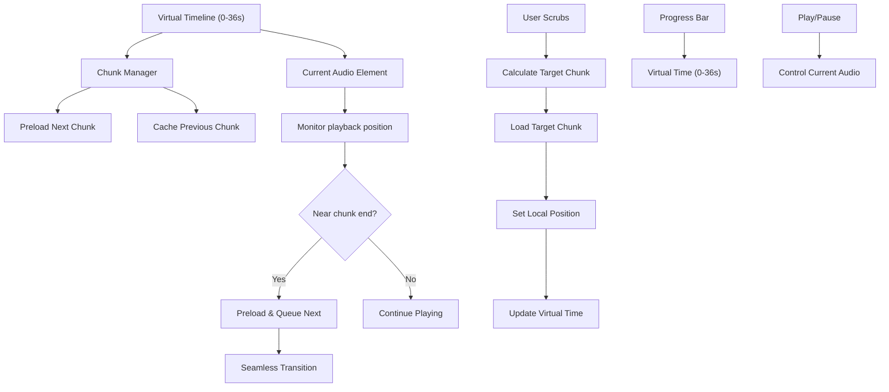

# 🎵 Seamless Audio Player Implementation Plan

## 📋 **Problem Statement**

The current audio player implementation has critical UX issues:
- **Discrete Chunk Playback**: Each 3.14s chunk plays separately with gaps
- **Manual Play Required**: User must click play for each chunk (12 times for full book)
- **Broken Scrubbing**: Progress bar shows 36s total but audio element only knows about current chunk
- **Poor Experience**: Feels like 12 separate audio files, not one continuous audiobook

## 🎯 **Solution Overview**

Implement a **Virtual Continuous Timeline** system that:
- Creates seamless 36-second playback experience
- Enables proper scrubbing across the full timeline
- Automatically transitions between chunks without user intervention
- Maintains responsive UI with accurate progress tracking

## 🏗️ **Architecture Diagram**



---

## 📋 **Phase 1: Virtual Timeline Foundation**

### **1.1 Update Type Definitions**
**File:** `src/types/audio.ts`

**New Interfaces:**
```typescript
// Enhanced virtual audio state
export interface VirtualAudioState extends AudioState {
  virtualCurrentTime: number;     // 0-36s total timeline position
  virtualDuration: number;        // Total book duration (36s)
  chunkLocalTime: number;         // Position within current chunk (0-3.14s)
  chunkOffsets: number[];         // [0, 3.14, 6.28, 9.42, ...] cumulative offsets
  isTransitioning: boolean;       // Flag for chunk transitions
}

// Enhanced chunk information
export interface AudioChunkInfo {
  index: number;
  duration: number;
  startTime: number;              // Virtual timeline start
  endTime: number;                // Virtual timeline end
  url?: string;
  isPreloaded: boolean;
}

// Virtual playback controls
export interface VirtualPlaybackControls extends PlaybackControls {
  seekToVirtualTime: (virtualTime: number) => Promise<void>;
  getCurrentVirtualTime: () => number;
  getTotalVirtualDuration: () => number;
}
```

### **1.2 Create Virtual Timeline Utilities**
**File:** `src/lib/audio/virtual-timeline.ts` *(new file)*

**Core Functionality:**
```typescript
export class VirtualTimelineManager {
  private chunkDurations: number[] = [];
  private chunkOffsets: number[] = [];
  private totalDuration: number = 0;

  // Initialize with chunk data from API
  initialize(chunks: AudioChunkInfo[]): void {
    this.chunkDurations = chunks.map(c => c.duration);
    this.chunkOffsets = this.calculateCumulativeOffsets();
    this.totalDuration = this.chunkOffsets[this.chunkOffsets.length - 1];
  }

  // Convert virtual time (0-36s) to chunk + local position
  getChunkPosition(virtualTime: number): { chunkIndex: number, localTime: number } {
    // Find which chunk contains this virtual time
    // Return chunk index and position within that chunk
  }

  // Convert chunk position to virtual time
  getVirtualTime(chunkIndex: number, localTime: number): number {
    return this.chunkOffsets[chunkIndex] + localTime;
  }

  // Get chunk that contains virtual time
  getChunkForTime(virtualTime: number): AudioChunkInfo {
    const { chunkIndex } = this.getChunkPosition(virtualTime);
    return this.chunks[chunkIndex];
  }

  // Calculate cumulative time offsets for chunks
  private calculateCumulativeOffsets(): number[] {
    const offsets = [0];
    for (let i = 0; i < this.chunkDurations.length - 1; i++) {
      offsets.push(offsets[i] + this.chunkDurations[i]);
    }
    return offsets;
  }
}
```

**Why This Phase First:**
- Foundation for all virtual timeline logic
- Required by all subsequent phases
- Minimal dependencies - can be implemented and tested independently

---

## 📋 **Phase 2: Enhanced Audio Streamer**

### **2.1 Upgrade Audio Streamer**
**File:** `src/lib/audio-streamer.ts`

**Major Modifications:**
```typescript
export class SeamlessAudioStreamer extends AudioStreamer {
  private virtualTimeline: VirtualTimelineManager;
  private preloadedChunks = new Map<number, string>();
  private nextChunkReady = false;
  private transitionBuffer: HTMLAudioElement | null = null;

  async initializeVirtualTimeline(): Promise<void> {
    // Initialize timeline manager with chunk data
    this.virtualTimeline = new VirtualTimelineManager();
    this.virtualTimeline.initialize(this.book.chunks);
  }

  async preloadNextChunk(currentChunk: number): Promise<void> {
    const nextChunk = currentChunk + 1;
    if (nextChunk < this.book.chunks.length && !this.preloadedChunks.has(nextChunk)) {
      const chunkUrl = await this.getChunkUrl(nextChunk);
      this.preloadedChunks.set(nextChunk, chunkUrl);
    }
  }

  async prepareSeamlessTransition(nextChunk: number): Promise<void> {
    // Prepare next chunk in buffer audio element
    if (this.preloadedChunks.has(nextChunk)) {
      this.transitionBuffer = new Audio(this.preloadedChunks.get(nextChunk));
      this.transitionBuffer.preload = 'auto';
      this.nextChunkReady = true;
    }
  }

  async transitionToNextChunk(): Promise<void> {
    // Seamlessly switch to next chunk without gaps
    if (this.nextChunkReady && this.transitionBuffer) {
      // Swap audio elements for gapless playback
      const oldAudio = this.audioElement;
      this.audioElement = this.transitionBuffer;
      this.transitionBuffer = null;
      this.nextChunkReady = false;
      
      // Clean up old audio
      oldAudio.pause();
      oldAudio.src = '';
    }
  }

  getVirtualPosition(): { virtualTime: number, totalDuration: number } {
    const currentTime = this.audioElement.currentTime;
    const virtualTime = this.virtualTimeline.getVirtualTime(this.currentChunk, currentTime);
    return {
      virtualTime,
      totalDuration: this.virtualTimeline.getTotalDuration()
    };
  }
}
```

### **2.2 Create Seamless Audio Manager**
**File:** `src/lib/audio/seamless-manager.ts` *(new file)*

**Purpose:** Orchestrates seamless playbook across chunks
```typescript
export class SeamlessAudioManager {
  private currentAudio: HTMLAudioElement;
  private bufferAudio: HTMLAudioElement;
  private isTransitioning = false;
  private preloadThreshold = 1.0; // Start preloading 1s before chunk end

  constructor() {
    this.currentAudio = new Audio();
    this.bufferAudio = new Audio();
    this.setupEventListeners();
  }

  private setupEventListeners(): void {
    this.currentAudio.addEventListener('timeupdate', this.handleTimeUpdate.bind(this));
    this.currentAudio.addEventListener('ended', this.handleChunkEnd.bind(this));
  }

  private handleTimeUpdate(): void {
    const remainingTime = this.currentAudio.duration - this.currentAudio.currentTime;
    
    // Start preparing transition when near end
    if (remainingTime <= this.preloadThreshold && !this.isTransitioning) {
      this.prepareTransition();
    }
  }

  async handleChunkEnd(): Promise<void> {
    if (this.bufferAudio.src && this.bufferAudio.readyState >= 2) {
      await this.switchAudioElements();
    }
  }

  async switchAudioElements(): Promise<void> {
    this.isTransitioning = true;
    
    // Seamlessly switch audio elements
    const tempAudio = this.currentAudio;
    this.currentAudio = this.bufferAudio;
    this.bufferAudio = tempAudio;
    
    // Start playing immediately
    await this.currentAudio.play();
    
    // Clean up old audio
    this.bufferAudio.pause();
    this.bufferAudio.src = '';
    
    this.isTransitioning = false;
  }

  async prepareNextChunk(chunkUrl: string): Promise<void> {
    this.bufferAudio.src = chunkUrl;
    this.bufferAudio.load();
  }
}
```

---

## 📋 **Phase 3: Updated Audio Hook**

### **3.1 Transform useAudio Hook**
**File:** `src/hooks/useAudio.ts`

**Complete Restructure for Virtual Timeline:**
```typescript
export function useSeamlessAudio(options: UseAudioOptions): UseSeamlessAudioReturn {
  // Virtual state management
  const [virtualState, setVirtualState] = useState<VirtualAudioState>();
  const [timelineManager] = useState(() => new VirtualTimelineManager());
  const [seamlessManager] = useState(() => new SeamlessAudioManager());
  const [streamer, setStreamer] = useState<SeamlessAudioStreamer>();

  // Enhanced initialization
  const initializeSeamlessAudio = useCallback(async () => {
    if (!bookId || !book) return;

    try {
      // Initialize seamless streamer
      const newStreamer = new SeamlessAudioStreamer(bookId, {
        onError: setCurrentError,
        onChunkChange: handleVirtualChunkChange,
        prefetchSize: 5,
      });

      await newStreamer.initialize();
      await newStreamer.initializeVirtualTimeline();
      
      // Initialize virtual state
      setVirtualState({
        ...initialAudioState,
        virtualCurrentTime: 0,
        virtualDuration: book.total_duration_s,
        chunkLocalTime: 0,
        chunkOffsets: newStreamer.getChunkOffsets(),
        isTransitioning: false,
      });

      setStreamer(newStreamer);
      setIsInitialized(true);
    } catch (error) {
      handleInitializationError(error);
    }
  }, [bookId, book]);

  // Virtual time update handler
  const handleVirtualTimeUpdate = useCallback(() => {
    if (!streamer || !virtualState) return;

    const { virtualTime, totalDuration } = streamer.getVirtualPosition();
    
    setVirtualState(prev => prev ? {
      ...prev,
      virtualCurrentTime: virtualTime,
      virtualDuration: totalDuration,
      currentTime: streamer.getCurrentLocalTime(),
    } : null);
  }, [streamer, virtualState]);

  // Enhanced virtual controls
  const virtualControls: VirtualPlaybackControls = useMemo(() => ({
    play: async () => {
      if (!streamer) return;
      await streamer.play();
    },

    pause: async () => {
      if (!streamer) return;
      await streamer.pause();
    },

    seek: async (time: number) => {
      // Legacy seek - still works but uses virtual time
      await virtualControls.seekToVirtualTime(time);
    },

    seekToVirtualTime: async (virtualTime: number) => {
      if (!streamer || !timelineManager) return;

      const { chunkIndex, localTime } = timelineManager.getChunkPosition(virtualTime);
      
      // Load target chunk if different
      if (chunkIndex !== virtualState?.currentChunk) {
        await streamer.loadChunk(chunkIndex);
      }
      
      // Seek to local position within chunk
      await streamer.seekToLocalTime(localTime);
      
      // Update virtual state
      setVirtualState(prev => prev ? {
        ...prev,
        virtualCurrentTime: virtualTime,
        currentChunk: chunkIndex,
        chunkLocalTime: localTime,
      } : null);
    },

    getCurrentVirtualTime: () => virtualState?.virtualCurrentTime || 0,
    getTotalVirtualDuration: () => virtualState?.virtualDuration || 0,

    setVolume: async (volume: number) => {
      if (!streamer) return;
      await streamer.setVolume(volume);
    },

    setPlaybackRate: async (rate: number) => {
      if (!streamer) return;
      await streamer.setPlaybackRate(rate);
    },

    skipForward: async (seconds: number) => {
      const newVirtualTime = (virtualState?.virtualCurrentTime || 0) + seconds;
      await virtualControls.seekToVirtualTime(newVirtualTime);
    },

    skipBackward: async (seconds: number) => {
      const newVirtualTime = Math.max(0, (virtualState?.virtualCurrentTime || 0) - seconds);
      await virtualControls.seekToVirtualTime(newVirtualTime);
    },
  }), [streamer, virtualState, timelineManager]);

  // Auto-setup seamless transitions
  useEffect(() => {
    if (!streamer || !seamlessManager) return;

    const handleNearChunkEnd = () => {
      const currentChunk = virtualState?.currentChunk || 0;
      const nextChunk = currentChunk + 1;
      
      if (nextChunk < book.chunks.length) {
        streamer.prepareSeamlessTransition(nextChunk);
      }
    };

    const handleAutoTransition = () => {
      seamlessManager.handleChunkEnd();
      handleVirtualTimeUpdate();
    };

    // Set up auto-transition listeners
    streamer.onNearChunkEnd = handleNearChunkEnd;
    streamer.onChunkEnd = handleAutoTransition;

    return () => {
      streamer.onNearChunkEnd = null;
      streamer.onChunkEnd = null;
    };
  }, [streamer, seamlessManager, virtualState, book]);

  return {
    virtualState,
    virtualControls,
    bookmarks: localBookmarks,
    isLoading: bookLoading || Boolean(bookId && !isInitialized),
    error: bookError ? { 
      type: 'network', 
      message: 'Failed to load book', 
      recoverable: true 
    } : currentError,
    book: book || null,
    addBookmark,
    removeBookmark,
    seekToBookmark,
    initialize,
    cleanup,
  };
}
```

---

## 📋 **Phase 4: Audio Player Component Updates**

### **4.1 Update Audio Player Component**
**File:** `src/components/features/player/AudioPlayer.tsx`

**Major UI Changes:**
```typescript
export function AudioPlayer({ bookId, autoPlay, onError }: AudioPlayerProps) {
  const {
    virtualState,      // Instead of audioState
    virtualControls,   // Instead of controls
    isLoading,
    error,
    book,
    addBookmark,
    removeBookmark,
  } = useSeamlessAudio({ bookId, autoPlay, onError });

  // Virtual progress calculation (0-100% of full 36s)
  const virtualProgress = virtualState?.virtualDuration > 0 
    ? (virtualState.virtualCurrentTime / virtualState.virtualDuration) * 100 
    : 0;

  // Enhanced seek handler for virtual timeline
  const handleVirtualSeek = useCallback((percentage: number) => {
    if (!virtualState || !book) return;
    
    const virtualTime = (percentage / 100) * virtualState.virtualDuration;
    virtualControls.seekToVirtualTime(virtualTime);
  }, [virtualState, book, virtualControls]);

  // Format virtual time display
  const formatVirtualTime = useCallback((seconds: number) => {
    const minutes = Math.floor(seconds / 60);
    const remainingSeconds = Math.floor(seconds % 60);
    return `${minutes}:${remainingSeconds.toString().padStart(2, '0')}`;
  }, []);

  // Rest of component logic remains similar...
}
```

### **4.2 Update Progress Bar and Time Display**
**Updated JSX in AudioPlayer.tsx:**
```typescript
{/* Header - now shows virtual timeline info */}
<div className="p-6 pb-4">
  <h3 className="text-lg font-semibold text-gray-900 dark:text-white mb-1">
    {book.title}
  </h3>
  <div className="flex items-center justify-between">
    <div className="flex items-center space-x-2">
      <Badge variant="secondary">
        {virtualState?.isTransitioning 
          ? 'Transitioning...' 
          : `Playing: ${formatVirtualTime(virtualState?.virtualCurrentTime || 0)}`
        }
      </Badge>
    </div>
    <span className="text-sm text-gray-500">
      {formatVirtualTime(virtualState?.virtualCurrentTime || 0)} / {formatVirtualTime(virtualState?.virtualDuration || 0)}
    </span>
  </div>
</div>

{/* Main Progress Bar - Virtual Timeline (0-36s) */}
<div className="px-6 pb-4">
  <div className="relative">
    <Progress 
      value={virtualProgress} 
      className="h-2 cursor-pointer"
      onClick={(e) => {
        const rect = e.currentTarget.getBoundingClientRect();
        const percentage = ((e.clientX - rect.left) / rect.width) * 100;
        handleVirtualSeek(percentage);
      }}
    />
    <div className="flex justify-between text-xs text-gray-500 mt-1">
      <span>{formatVirtualTime(virtualState?.virtualCurrentTime || 0)}</span>
      <span>{formatVirtualTime(virtualState?.virtualDuration || 0)}</span>
    </div>
  </div>
</div>

{/* Controls - Enhanced for seamless playback */}
<div className="px-6 pb-6">
  <div className="flex items-center justify-center space-x-4 mb-4">
    {/* Skip Back - Now works with virtual timeline */}
    <Button
      variant="outline"
      size="sm"
      onClick={() => virtualControls.skipBackward(30)}
      disabled={virtualState?.isLoading || virtualState?.isTransitioning}
      className="h-10 w-10 p-0"
    >
      <SkipBackIcon className="w-4 h-4" />
    </Button>

    {/* Play/Pause - Seamless across chunks */}
    <Button
      onClick={virtualState?.isPlaying ? virtualControls.pause : virtualControls.play}
      disabled={virtualState?.isLoading || virtualState?.isTransitioning}
      size="lg"
      className="h-14 w-14 rounded-full"
    >
      {virtualState?.isLoading || virtualState?.isTransitioning ? (
        <Loader2Icon className="w-6 h-6 animate-spin" />
      ) : virtualState?.isPlaying ? (
        <PauseIcon className="w-6 h-6" />
      ) : (
        <PlayIcon className="w-6 h-6" />
      )}
    </Button>

    {/* Skip Forward - Now works with virtual timeline */}
    <Button
      variant="outline"
      size="sm"
      onClick={() => virtualControls.skipForward(30)}
      disabled={virtualState?.isLoading || virtualState?.isTransitioning}
      className="h-10 w-10 p-0"
    >
      <SkipForwardIcon className="w-4 h-4" />
    </Button>
  </div>
  
  {/* Secondary controls remain the same */}
</div>
```

---

## 📋 **Phase 5: Testing & Debug Updates**

### **5.1 Update Debug Component**
**File:** `src/components/debug/AudioPlayerTest.tsx`

**Add Virtual Timeline Testing:**
```typescript
const testVirtualTimeline = async () => {
  try {
    addLog('Testing virtual timeline...');
    
    // Test virtual time calculations
    const testTimes = [0, 9.42, 18.84, 36.0]; // Start, quarter, half, end
    
    for (const virtualTime of testTimes) {
      const { chunkIndex, localTime } = timelineManager.getChunkPosition(virtualTime);
      addLog(`Virtual ${virtualTime}s -> Chunk ${chunkIndex}, Local ${localTime.toFixed(2)}s`);
    }
    
    // Test scrubbing to middle
    addLog('Testing scrub to middle (18s)...');
    await virtualControls.seekToVirtualTime(18.0);
    
    const currentVirtualTime = virtualControls.getCurrentVirtualTime();
    addLog(`Scrubbed to: ${currentVirtualTime.toFixed(2)}s`);
    
    // Test seamless transition
    addLog('Testing seamless playback (will auto-transition chunks)...');
    await virtualControls.play();
    
  } catch (error) {
    addLog(`Virtual timeline test failed: ${error}`);
  }
};

// Add to existing test UI
<Button onClick={testVirtualTimeline} variant="outline">
  Test Virtual Timeline
</Button>
```

### **5.2 Enhanced API Testing**
**Additional test functions:**
```typescript
const testSeamlessPlayback = async () => {
  addLog('Testing seamless playback...');
  
  // Start from beginning
  await virtualControls.seekToVirtualTime(0);
  await virtualControls.play();
  
  addLog('Playing continuously - should auto-transition chunks without gaps');
  addLog('Watch for seamless transitions every ~3.14 seconds');
};

const testAdvancedScrubbing = async () => {
  addLog('Testing advanced scrubbing...');
  
  const scrubPositions = [5.5, 12.3, 25.8, 34.2];
  
  for (const position of scrubPositions) {
    addLog(`Scrubbing to ${position}s...`);
    await virtualControls.seekToVirtualTime(position);
    
    // Brief pause to see result
    await new Promise(resolve => setTimeout(resolve, 1000));
    
    const actualPosition = virtualControls.getCurrentVirtualTime();
    addLog(`Position: ${actualPosition.toFixed(2)}s (target: ${position}s)`);
  }
};
```

---

## 📋 **Implementation Order & Dependencies**

### **🔴 Phase 1: Foundation (Required First)**
1. ✅ **Update `src/types/audio.ts`** - Add virtual timeline interfaces
2. ✅ **Create `src/lib/audio/virtual-timeline.ts`** - Core virtual timeline logic

*Dependencies: None - Pure utility functions*

### **🟡 Phase 2: Enhanced Backend (Depends on Phase 1)**
3. ✅ **Enhance `src/lib/audio-streamer.ts`** - Add seamless capabilities
4. ✅ **Create `src/lib/audio/seamless-manager.ts`** - Orchestrate seamless playback

*Dependencies: Virtual timeline utilities from Phase 1*

### **🟢 Phase 3: Hook Integration (Depends on Phases 1-2)**
5. ✅ **Transform `src/hooks/useAudio.ts`** - Virtual timeline integration

*Dependencies: Enhanced streamer and seamless manager from Phase 2*

### **🔵 Phase 4: UI Updates (Depends on Phases 1-3)**
6. ✅ **Update `src/components/features/player/AudioPlayer.tsx`** - Virtual timeline UI

*Dependencies: Virtual controls from updated useAudio hook*

### **🟣 Phase 5: Testing & Polish (Depends on All Previous)**
7. ✅ **Update `src/components/debug/AudioPlayerTest.tsx`** - Virtual timeline testing

*Dependencies: Complete virtual timeline system*

---

## 📋 **File Modification Summary**

### **🔴 Critical Files (Must Modify)**
| File | Purpose | Complexity | Priority |
|------|---------|------------|----------|
| `src/types/audio.ts` | Add virtual timeline types | Low | Critical |
| `src/hooks/useAudio.ts` | Convert to seamless audio hook | High | Critical |
| `src/lib/audio-streamer.ts` | Enhance for seamless playback | Medium | Critical |
| `src/components/features/player/AudioPlayer.tsx` | Update UI for virtual timeline | Medium | Critical |

### **🟡 New Files (Must Create)**
| File | Purpose | Complexity | Priority |
|------|---------|------------|----------|
| `src/lib/audio/virtual-timeline.ts` | Virtual timeline utilities | Medium | High |
| `src/lib/audio/seamless-manager.ts` | Seamless playback orchestration | High | High |

### **🟢 Optional Files (Nice to Have)**
| File | Purpose | Complexity | Priority |
|------|---------|------------|----------|
| `src/components/debug/AudioPlayerTest.tsx` | Add virtual timeline testing | Low | Low |
| `src/lib/audio/preloader.ts` | Advanced chunk preloading | Medium | Low |

---

## 🎯 **Expected Results**

### **✅ Before Implementation (Current Issues)**
- ❌ 12 separate audio chunks with gaps
- ❌ Manual play button required for each chunk
- ❌ Broken scrubbing (3.14s vs 36s timeline)
- ❌ Poor user experience

### **✅ After Implementation (Expected Results)**
- ✅ **Seamless 36-second continuous playback**
- ✅ **Automatic chunk transitions** (transparent to user)
- ✅ **Full timeline scrubbing** (0-36s anywhere)
- ✅ **Responsive progress bar** (accurate position)
- ✅ **Proper time display** (virtual time format)
- ✅ **Professional audiobook experience**

### **🎯 Success Metrics**
1. **Zero gaps** between chunk transitions
2. **Zero manual interventions** required during playback
3. **Accurate scrubbing** to any position in 36s timeline
4. **Responsive UI** that matches actual audio position
5. **Smooth performance** with preloading and caching

---

## 🚀 **Getting Started**

1. **Start with Phase 1**: Update types and create virtual timeline utilities
2. **Test each phase** before moving to the next
3. **Use debug component** to verify virtual timeline calculations
4. **Monitor browser console** for seamless transition logs
5. **Test extensively** with scrubbing and continuous playback

Ready to implement? Start with Phase 1! 🎵
